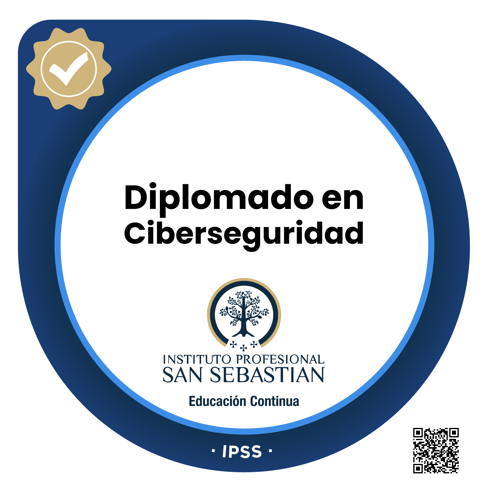

# ¡Hola! Soy Joaquín 👋

Desarrollador Fullstack enfocado en **JavaScript/Node.js** y **PHP/Laravel**, con Diplomado en Ciberseguridad completado. Me gusta construir proyectos que resuelven problemas reales: automatización, scraping de datos y dashboards con alertas.

- 🔭 Trabajando actualmente en proyectos freelance (Node.js/Express) y como Asesor en Falabella Chile
- 🛡️ Diplomado en Ciberseguridad (IPSS) — aplico criterios de seguridad desde el diseño
- 🌱 Aprendiendo constantemente sobre infraestructura y despliegue (Railway, VPS)
- 📫 Contacto: joaquin.escobar.dev@gmail.com | [LinkedIn](https://linkedin.com/in/joaquinescobarlet)
- 📄 [Descargar mi CV](./cv/cv.pdf)

## 🚀 Proyectos destacados

**[Catálogo Falabella — Tracker de Precios](https://github.com/JoaquinEscobarDev/catalogo-falabella)**
Aplicación Node.js/Express que monitorea precios diarios de productos en Falabella Chile, parseando datos estructurados directamente del HTML. Desplegada en Railway.

**Dashboard USD/CLP** — [ver proyecto](https://github.com/JoaquinEscobarDev/proyectos/tree/master/dolar-tracker)
Seguimiento del tipo de cambio con 7 indicadores técnicos (RSI, SMA, EMA, MACD, Bollinger, Estocástico, ATR) y sistema de señal COMPRAR/VENDER/ESPERAR. Notificaciones push y modo claro/oscuro. Desplegado en Hostinger.

## 🛠️ Stack

`JavaScript` `Node.js` `Express` `PHP` `Laravel` `HTML/CSS` `MySQL` `PostgreSQL` `Git`

## 📜 Certificaciones

**Diplomado en Ciberseguridad** — Instituto Profesional San Sebastián (IPSS)

